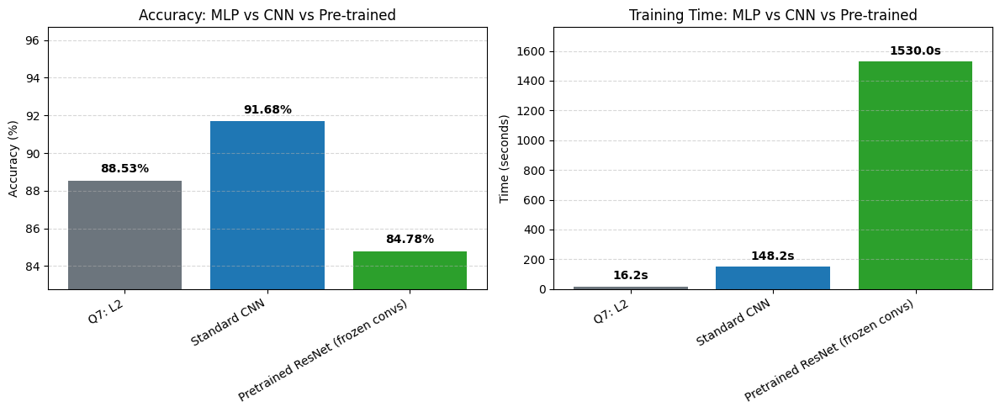
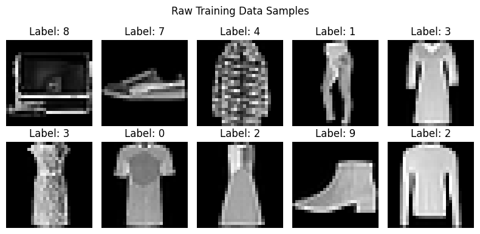
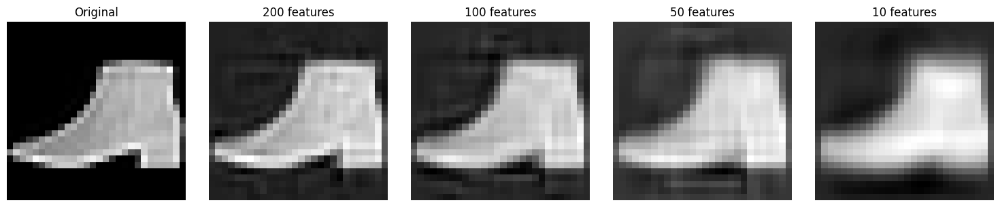
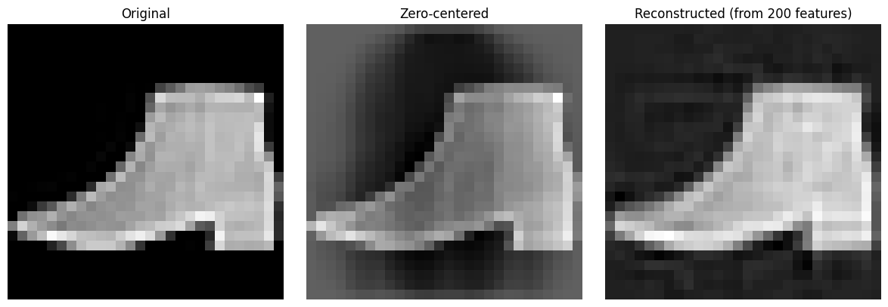
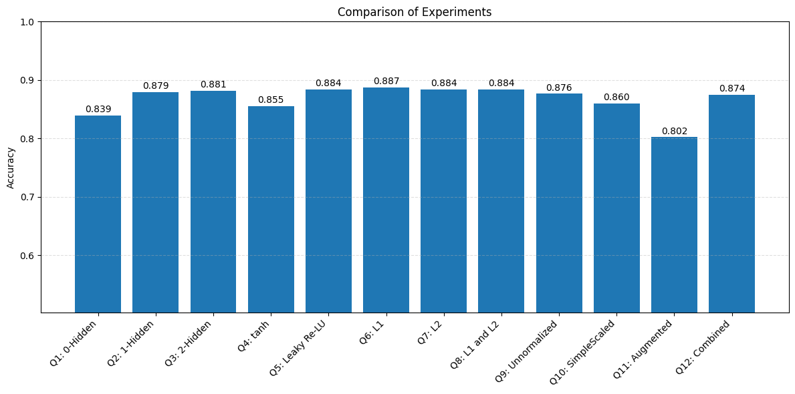
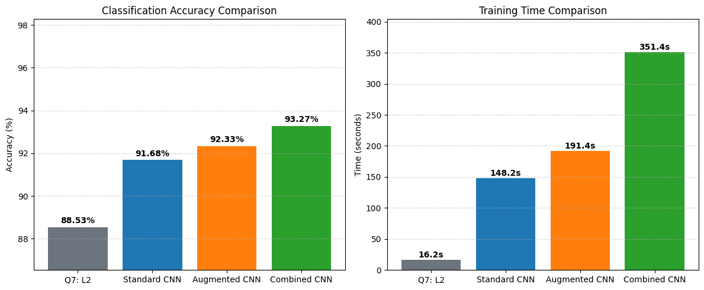

# mlp-cnn-fashion-mnist
McGill COMP 551 - Mini-Project 3: Implementing Multi-Layer Perceptrons (MLP) from scratch with backpropagation, and comparing performance against CNN and ResNet architectures using PyTorch on the Fashion-MNIST dataset.

- Gabriel Caballero (261108565)
- Adam Dufour (261193949)

## Prerequisites
* Python 3.8+
* Packages in requirements.txt
```bash
pip install -r requirements.txt
```



## Project
The notebook is structured in 4 main tasks:
* Task 1: Obtaining and cleaning data

  * Whitening
    * 
  * PCA
    * 
  * Data augmentation
    * 
* Task 2: MLP implementation from scratch
  * 
* Task 3: Running the experiments
  * Regularization
  * CNN comparison
    * 
  * ResNet18 comparison (transfer learning)

## Running the Code
Launch the Jupyter Notebook / JupyterLab from your terminal (or use PyCharm/VSCode) and click run, all the tests will start running automatically
